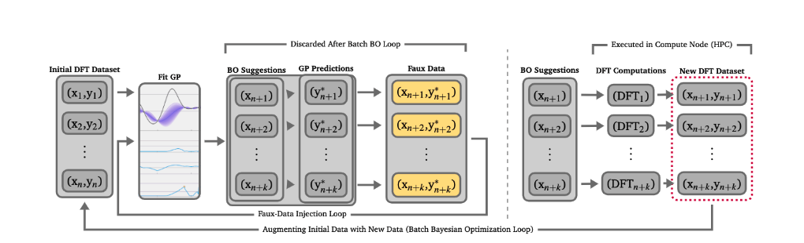

# Faux data Injection Bayesian Optimization

Bayesian optimization with Faux-data injection loop is illustrated in the figure below: 

To install the required python packages run: 

`pip install -r requirements.txt`

rocketsled is part of this code so no need to install it. Add your corresponding VASP path in `~./bashrc` using the variable `VASP_PATH` such as below:

`export VASP_PATH='lustre/software/vasp/vasp.5.4.4.pl2/bin/'`

create conda virtural environment as below:

`conda create -n fdibo_env python==3.6`

`conda config --append channels conda-forge`

`conda activate fdibo_env`

copy/paste fireworks template writer files to current fireworks directory

copy paste POTCAR FOLDER -> `/cray_home/user_name/vasp_potcar/MY_PSP`

copy paste templates to `~/site-packages/fireworks/user_objects/firetasks/templates`

`gedit ~/.pmgrc.yaml`

#Add these lines:

`PMG_DEFAULT_FUNCTIONAL: PBE_54`

`PMG_VASP_PSP_DIR: /cray_home/user_name/vasp_potcar/MY_PSP/`

#Run in login-node using this which will automatically submit job to compute node. the terminal can be closed and the job will remain active with disown -h

`python BOang-HT-vasp.py (method) </dev/null> name.log 2>1 & disown -h "$!"`

available methods are : FDI-BO
                       TOPK-BO
                       S-BO
                       random
